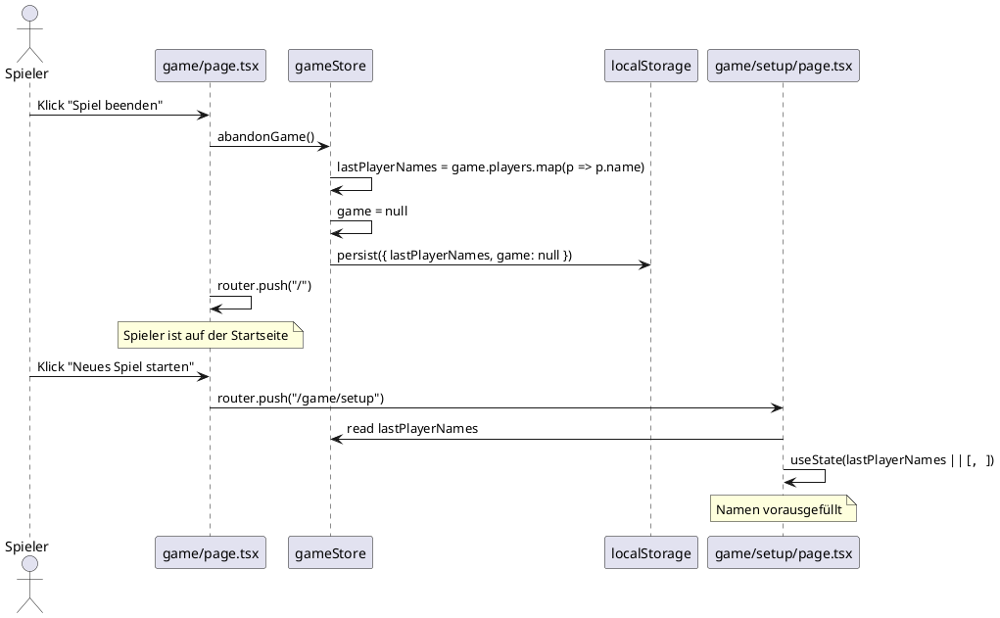

# Feature: Spiel abbrechen (abandon-game)

**Status:** In Planung  
**Datum:** 2026-06-09

---

## Kontext

Während eines laufenden Wizard-Spiels möchte ein Spieler die Möglichkeit haben, das Spiel vorzeitig zu beenden. Nach dem Abbruch soll er zur Startseite weitergeleitet werden. Beim nächsten Spielstart sollen die zuvor eingetragenen Spielernamen bereits vorausgefüllt sein, damit kein erneutes manuelles Eintippen notwendig ist.

---

## Bounded Contexts

### GameSession (laufendes Spiel)
- **Aggregate Root:** `Game`
- **Domain Event:** `GameAbandoned` — das aktuelle Spiel wird vorzeitig beendet
- **Invariante:** Beim Abbruch bleiben die Spielernamen persistent gespeichert, das Spiel selbst wird gelöscht

### GameSetup (Spielvorbereitung)
- **Aggregate Root:** Kein eigenes Aggregate — nutzt gespeicherte `lastPlayerNames` als Vorschlagswerte
- **Abhängigkeit:** Liest `lastPlayerNames` aus dem globalen Store

---

## Domänenmodell

### Erweiterung des GameStore

```
GameStore (bestehend)
  game: Game | null
  resetGame(): void
  ...

GameStore (erweitert)
+ lastPlayerNames: string[]         ← neu
+ abandonGame(): void               ← neu (setzt lastPlayerNames, löscht game)
```

`abandonGame()` ist semantisch unterschiedlich von `resetGame()`:
- `resetGame()` dient dem bewussten Neustart (Spielernamen werden verworfen)
- `abandonGame()` behält die Spielernamen für den nächsten Setup-Durchlauf

### Setup-Seite

Die Setup-Seite initialisiert ihren lokalen `names`-State aus `lastPlayerNames` im Store (falls vorhanden), statt mit leeren Strings zu starten.

---

## Integrationspunkte

| Von | Nach | Beschreibung |
|-----|------|--------------|
| `game/page.tsx` | `gameStore.abandonGame()` | Button löst Abbruch aus |
| `gameStore` | `localStorage` | `lastPlayerNames` wird persistiert (via Zustand `persist`) |
| `game/setup/page.tsx` | `gameStore.lastPlayerNames` | Vorausfüllen der Namenfelder |
| `game/page.tsx` | `router.push("/")` | Navigation nach Abbruch |

---

## Sequenzdiagramm




---

## Designentscheidungen

- [ADR-008](../decisions/ADR-008-abandon-game-last-player-names.md): Trennung von `abandonGame()` und `resetGame()` sowie Persistenz von `lastPlayerNames`
