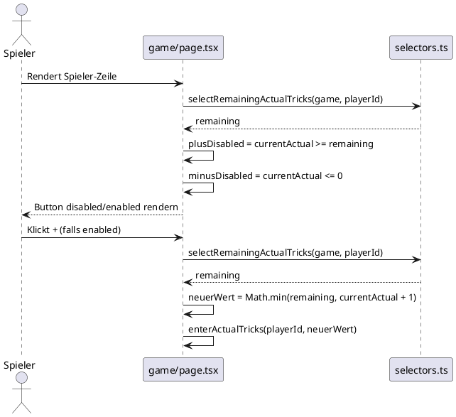

# Architektur: Button-Constraints für tatsächliche Stiche

**Feature:** `actual-tricks-button-constraints`  
**Datum:** 2026-06-09  
**Autor:** Architekt-Rolle

---

## Problem

In der `playing`-Phase kann ein Spieler den Plus-Button unbegrenzt betätigen, auch wenn:

1. **Einzelmaximum überschritten**: Der Spieler würde mehr Stiche bekommen als insgesamt Karten existieren (`cardCount`).
2. **Gesamtmaximum überschritten**: Die Summe aller bisher eingetragenen Stiche plus der neue Wert würde `cardCount` überschreiten.

Der Grund ist ein Fehler in der bisherigen `onClick`-Berechnung:

```
Math.min(currentActual + remaining, currentActual + 1)
```

Wenn `remaining = cardCount - othersSum` (nur nicht-null Werte anderer Spieler) und alle anderen noch `null` haben, ist `remaining = cardCount`. Bei `currentActual = cardCount` ergibt sich: `Math.min(cardCount + cardCount, cardCount + 1) = cardCount + 1` — der Wert überschreitet das Maximum.

Zusätzlich fehlt ein `disabled`-Attribut an beiden Buttons:
- **Plus-Button**: kein disabled bei Erreichen des Maximums
- **Minus-Button**: kein disabled bei Wert 0

---

## Bounded Context

Betroffen ist ausschließlich der **Game-Bounded-Context**, Phase `playing`.  
Keine Integrationspunkte zu externen Systemen.

### Aggregate Root

`Game` → `Round` → `PlayerRoundScore[]`

Die Invariante bleibt dieselbe wie in ADR-003:
> `sum(playerScores[*].actualTricks) ≤ round.cardCount` zu jedem Zeitpunkt der Eingabe

---

## Domänenmodell (Änderungen)

### Keine neuen Selektoren nötig

Der bestehende Selektor `selectRemainingActualTricks(game, playerId)` liefert bereits den korrekten Maximalwert für einen Spieler:

```
remaining = max(0, cardCount − sum(actualTricks anderer Spieler mit nicht-null Wert))
```

Das bedeutet: Der Spieler darf maximal `remaining` Stiche haben.

### Korrekte Ableitung des disabled-States

| Button | Disabled wenn |
|--------|---------------|
| Plus   | `(ps.actualTricks ?? 0) >= selectRemainingActualTricks(game, player.id)` |
| Minus  | `(ps.actualTricks ?? 0) <= 0` |

### Korrigierte onClick-Logik (Plus)

```
Math.min(remaining, currentActual + 1)
```

statt bisher:

```
Math.min(currentActual + remaining, currentActual + 1)
```

---

## Sequenzdiagramm: Button-Constraint-Prüfung




---

## Entscheidung

Siehe [ADR-006](../decisions/ADR-006-actual-tricks-button-disabled-state.md)

---

## Nicht im Scope

- Gebote (`predictedTricks`) — separate Regel, kein Summen-Constraint
- Store-Reducer `enterActualTricks` — bleibt unverändert
- Neue Selektoren — bestehender `selectRemainingActualTricks` reicht
