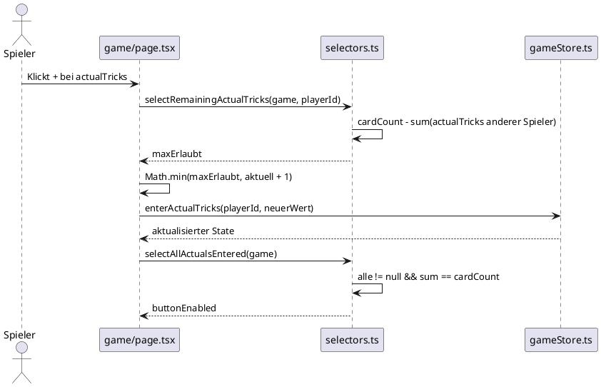

# Architektur: Validierung der Stich-Summe (actual tricks)

**Feature:** `actual-tricks-sum-validation`  
**Datum:** 2026-06-09  
**Autor:** Architekt-Rolle

---

## Problem

Beim Eingeben der tatsächlichen Stiche in der Spielphase wird jeder Spieler
nur individuell auf `cardCount` gedeckelt. Die Domänen-Invariante des Wizard-
Spiels besagt jedoch: **Die Summe aller tatsächlichen Stiche einer Runde muss
exakt gleich `cardCount` sein.**

Aktuell kann ein Spieler 3 Stiche eingeben, obwohl andere Spieler bereits alle
3 verfügbaren Stiche beansprucht haben — der Store akzeptiert ungültige Zustände.

---

## Bounded Context

Betroffen ist ausschließlich der **Game-Bounded-Context** in der aktuellen Runde,
Phase `playing`. Es gibt keine Integrationspunkte zu externen Systemen.

### Aggregate Root

`Game` → `Round` → `PlayerRoundScore[]`

Die Invariante gehört zum Aggregat `Round`:

> Für jede `Round` im Status `complete` gilt:  
> `sum(playerScores[*].actualTricks) === round.cardCount`

---

## Domänenmodell (Änderungen)

### Neue Selektoren in `src/store/selectors.ts`

| Selektor | Signatur | Beschreibung |
|----------|----------|--------------|
| `selectRemainingActualTricks` | `(game, playerId) → number` | Wie viele Stiche darf dieser Spieler noch eingeben? (`cardCount − Σ anderer`) |
| `selectActualTricksSumValid` | `(game) → boolean` | Ist die Summe exakt gleich `cardCount`? |

### Änderung an `selectAllActualsEntered`

Erweitern um: alle eingetragen **und** Summe === `cardCount`.

---

## Sequenzdiagramm: Stich-Eingabe mit Summenvalidierung

---

## Entscheidung

Siehe [ADR-003](../decisions/ADR-003-actual-tricks-sum-constraint-in-selectors.md)

---

## Nicht im Scope

- Gebote (`predictedTricks`) dürfen die `cardCount`-Summe überschreiten — das ist Spielregel.
- Keine Änderung am Store-Reducer `enterActualTricks` nötig (Caps in der UI reichen).
- Kein Server-seitiges Constraint nötig (localStorage-App ohne Backend).
