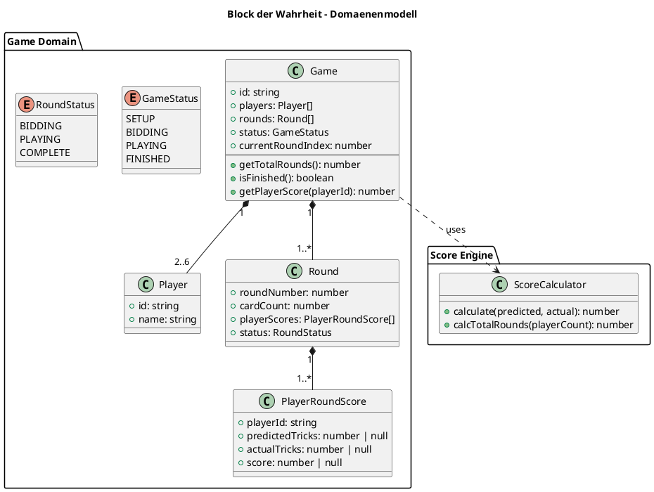

# Architektur: Block der Wahrheit

**Feature:** Block der Wahrheit – Stich-Protokoll für das Kartenspiel Wizard  
**Datum:** 2026-06-08  
**Status:** Entwurf

---

## Überblick

Die Anwendung ist ein digitaler Spielblock für das Kartenspiel **Wizard**. Sie ersetzt den physischen „Block der Wahrheit", auf dem Spieler ihre Stich-Voraussagen und -Ergebnisse notieren. Das eigentliche Kartenspiel findet weiterhin physisch statt; die App übernimmt nur die Protokollierung und Punkteberechnung.

---

## Spielregeln (relevanter Ausschnitt)

| Spieler | Karten im Spiel | Max. Runden |
|---------|-----------------|-------------|
| 2       | 60              | 30          |
| 3       | 60              | 20          |
| 4       | 60              | 15          |
| 5       | 60              | 12          |
| 6       | 60              | 10          |

**Rundenzahl:** `Math.floor(60 / Spieleranzahl)`

**Punkteberechnung pro Spieler und Runde:**
- Voraussage exakt getroffen: `+20 + (Stiche × 10)`
- Voraussage verfehlt: `-10 × |Ist – Soll|`

---

## Bounded Context

Es gibt einen einzigen Bounded Context: **Spielverwaltung**. Die App ist vollständig client-seitig und benötigt keine Backend-Integration für den Prototypen.

```
┌─────────────────────────────────────────┐
│         Spielverwaltung (BC)            │
│                                         │
│  ┌─────────┐   ┌────────┐   ┌────────┐  │
│  │  Game   │──▶│ Round  │──▶│ Score  │  │
│  │ (Root)  │   │        │   │ Engine │  │
│  └─────────┘   └────────┘   └────────┘  │
│                                         │
│  Persistenz: Browser localStorage       │
└─────────────────────────────────────────┘
```

---

## Domänenmodell

### Aggregate Root: `Game`

```typescript
interface Game {
  id: string;                   // UUID
  createdAt: string;            // ISO-8601
  players: Player[];            // 2–6 Spieler
  rounds: Round[];              // aufsteigend befüllt
  status: GameStatus;
  currentRoundIndex: number;    // 0-basiert
}

type GameStatus = 'setup' | 'bidding' | 'playing' | 'finished';
```

### Entity: `Player`

```typescript
interface Player {
  id: string;   // UUID
  name: string; // frei wählbar, ≥ 1 Zeichen
}
```

### Entity: `Round`

```typescript
interface Round {
  roundNumber: number;          // 1-basiert
  cardCount: number;            // = roundNumber
  playerScores: PlayerRoundScore[];
  status: RoundStatus;
}

type RoundStatus = 'bidding' | 'playing' | 'complete';
```

### Value Object: `PlayerRoundScore`

```typescript
interface PlayerRoundScore {
  playerId: string;
  predictedTricks: number | null;  // null = noch nicht eingetragen
  actualTricks: number | null;     // null = Runde läuft noch
  score: number | null;            // null = Runde nicht abgeschlossen
}
```

### Score Engine (pure Funktion, kein Zustand)

```typescript
function calculateScore(predicted: number, actual: number): number {
  return predicted === actual
    ? 20 + actual * 10
    : -10 * Math.abs(actual - predicted);
}

function calculateTotalRounds(playerCount: number): number {
  return Math.floor(60 / playerCount);
}
```

---

## Diagramm: Domänenmodell




---

## Spielfluss (State Machine)

```
[Setup] → [Bidding] → [Playing] → [Bidding] → ... → [Finished]
            ↑           |
            |___(nächste Runde)
```

1. **Setup:** Spielernamen eintragen, Spiel starten
2. **Bidding:** Vor jeder Runde gibt jeder Spieler seine Stich-Voraussage ein
3. **Playing:** Karten werden physisch gespielt (außerhalb der App)
4. **Results:** Tatsächliche Stiche werden eingetragen → Punkte werden berechnet
5. **Fertig:** Letzte Runde abgeschlossen → Gesamtrangliste

---

## Integrationspunkte

| System        | Art          | Details                                      |
|---------------|--------------|----------------------------------------------|
| localStorage  | Persistenz   | Spielzustand wird als JSON gespeichert       |
| Vercel        | Deployment   | Statische Next.js-App, kein Server-Side-Code |

---

## Technologie-Stack

| Schicht        | Technologie           | Begründung                                    |
|----------------|-----------------------|-----------------------------------------------|
| Framework      | Next.js 14 (App Router) | T3-Stack-Basis, Vercel-Deployment             |
| Sprache        | TypeScript            | Typsicherheit für Domänenmodell               |
| Styling        | Tailwind CSS          | T3-Stack-Standard                             |
| Zustandsverwaltung | Zustand (Zustand-Library) | Einfach, localStorage-Adapter vorhanden |
| Validierung    | Zod                   | Schema-Validierung für Formulareingaben       |
| Persistenz     | localStorage          | Kein Backend nötig im Prototypen              |

> **Hinweis:** tRPC und Prisma werden im Prototypen weggelassen, da kein Backend benötigt wird. Der T3-Stack liefert dennoch die Projektstruktur und TypeScript-Konfiguration.
