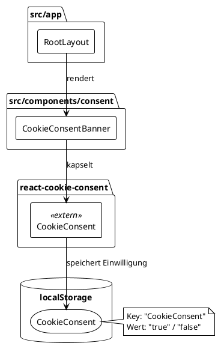

# Architektur: Cookie-Consent-Banner

**Datum:** 2026-06-13  
**Status:** entwurf  
**Feature:** Cookie Consent (DSGVO-konformes Hinweisbanner)

---

## Kontext

„Block der Wahrheit" ist eine statische Next.js-App, die auf Vercel deployed wird.  
Sie speichert Spielstand ausschließlich im **Browser-localStorage** (kein Backend, keine serverseitigen Cookies).

### Datenspeicherung im Ist-Zustand

| Speicherort     | Schlüssel             | Zweck                  | Rechtsgrundlage                          |
|-----------------|-----------------------|------------------------|------------------------------------------|
| localStorage    | `wizard-game-store`   | Spielstand persistieren | Art. 6 Abs. 1 lit. f DSGVO (berechtigtes Interesse / technisch notwendig) |

Da kein Tracking, keine Analyse und keine Drittanbieter-Skripte eingebunden sind, entfällt die Pflicht zur aktiven Einholung einer Einwilligung (Art. 5 Abs. 3 ePrivacy-RL). Es genügt eine **transparente Information** (Hinweisbanner).

---

## Bounded Context: Consent

Das Cookie-Consent-Feature bildet einen eigenen kleinen Bounded Context **Legal/Compliance**, der bewusst von der Spiellogik getrennt ist.

```
┌──────────────────────────────────────────┐
│           Bounded Context: Consent       │
│                                          │
│  Aggregate Root: ConsentDecision         │
│  ├── Attribut: status (accepted|pending) │
│  └── Methoden: accept(), reset()         │
│                                          │
│  Domain Event: ConsentAccepted           │
└──────────────────────────────────────────┘
```

**Integrationspunkt:** Das Banner wird im `RootLayout` gerendert, sodass es auf allen Seiten erscheint.

---

## Komponentendiagramm




---

## Domänenmodell

```
ConsentDecision
├── status: "pending" | "accepted"
└── persistedIn: localStorage["CookieConsent"]

CookieConsentBanner (React-Komponente)
├── Input: –
├── Output: (sichtbar, wenn status === "pending")
└── Nutzt: react-cookie-consent <CookieConsent>
```

---

## Designentscheidungen

- [ADR-008](../decisions/ADR-008-react-cookie-consent-bibliothek.md): Bibliothekswahl `react-cookie-consent`

---

## Nicht-funktionale Anforderungen

| Anforderung        | Ziel                                                              |
|--------------------|-------------------------------------------------------------------|
| Sprache            | Deutsch (Banner-Text auf Deutsch)                                 |
| Zugänglichkeit     | WCAG 2.1 AA – Fokus-Management, ARIA-Attribute durch Library      |
| Mobile             | Responsiv, kein überlagerndes Layout                              |
| Performance        | Tree-shaking-fähig, kein unnötiger Render-Overhead                |
| Rechtskonformität  | DSGVO-konform gemäß Telekommunikation-Telemedien-Datenschutz-Gesetz (TTDSG) |
