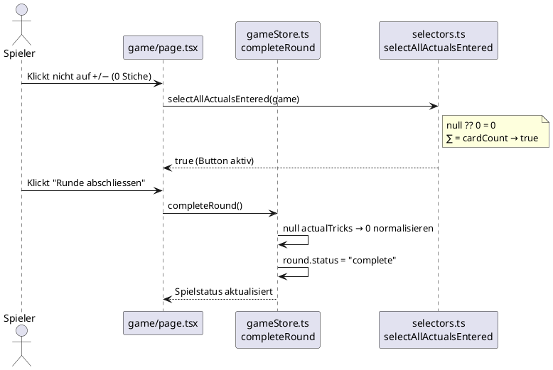

# Architektur: Null-Actual Default Zero

**Feature:** `null-actual-default-zero`  
**Datum:** 2026-06-09  
**Autor:** Architekt-Rolle

---

## Problembeschreibung

In der Spielphase (`playing`) bleibt `actualTricks` für jeden Spieler initial auf `null`. Die UI rendert `ps.actualTricks ?? 0` — zeigt also `0` an, ohne den Wert je explizit zu setzen. Spieler, die **0 Stiche** machen, klicken weder `+` noch `−` und hinterlassen `actualTricks === null`.

`selectAllActualsEntered` prüft `ps.actualTricks !== null` als notwendige Bedingung. Die Runde kann damit nicht abgeschlossen werden, obwohl mathematisch alle Stiche korrekt vergeben sind.

---

## Bounded Context

**Domain:** Spielrundenabschluss (`completeRound`)  
**Aggregate Root:** `Game` → `Round` → `PlayerRoundScore`

Relevante Felder:
- `PlayerRoundScore.actualTricks: number | null`
- `Round.cardCount: number`
- `selectAllActualsEntered(game: Game): boolean`

---

## Domänenmodell

```
Round
├── cardCount: number
└── playerScores[]: PlayerRoundScore
    ├── playerId: string
    ├── actualTricks: number | null   ← null = implizit 0
    └── score: number | null
```

**Invariante:** `∑ actualTricks (null = 0) = cardCount` → Runde vollständig

---

## Entscheidung

Analog zu ADR-005 (leere Vorhersage = 0):

1. **`selectAllActualsEntered`**: Entfernung der strikten `!== null`-Prüfung. Stattdessen genügt: `∑(actualTricks ?? 0) === cardCount`. Dies ist die einzig notwendige und hinreichende Bedingung.

2. **`completeRound`**: Normalisierung aller `null`-Werte auf `0` vor dem Rundenwechsel (analog zu `advanceToPlaying`).

---

## Integrationspunkte

| Komponente | Änderung |
|---|---|
| `src/store/selectors.ts` | `selectAllActualsEntered` vereinfachen |
| `src/store/gameStore.ts` | `completeRound` normalisiert null → 0 |
| `src/tests/selectors.test.ts` | Neuer Test: null-Actual gilt als 0 |
| `src/tests/gameStore.test.ts` | Neuer Test: completeRound mit null-Actual |

---

## Sequenzdiagramm


