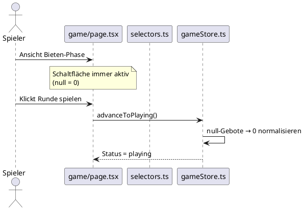

# Architektur: Leere Vorhersage zählt als 0

**Feature:** `null-bid-default-zero`  
**Datum:** 2026-06-09  
**Autor:** Architekt-Rolle

---

## Problem

In der Bieten-Phase (`bidding`) wird `predictedTricks` initial als `null` geführt — als Signal, dass ein Spieler noch keine Eingabe gemacht hat. Die Schaltfläche „Runde spielen" ist erst aktiv, wenn alle Spieler explizit einen Wert gewählt haben (inkl. durch Klick auf „−" für 0).

Da die UI den Wert `null` bereits als `0` anzeigt (`{ps.predictedTricks ?? 0}`), ist das für Nutzer verwirrend: der angezeigte Wert stimmt, aber der Button bleibt gesperrt.

---

## Bounded Context

Betroffen ist ausschließlich der **Game-Bounded-Context**, Phase `bidding`.

### Aggregate Root

`Game` → `Round` → `PlayerRoundScore[]`

Die relevante Invariante: Beim Übergang `bidding → playing` muss jeder Spieler ein Gebot haben. Bisher wurde `null` als „kein Gebot" gewertet. Nach der Änderung gilt `null` als implizites Gebot `0`.

---

## Domänenmodell

### Betroffene Dateien

| Datei | Änderung |
|-------|----------|
| `src/store/selectors.ts` | `selectAllBidsEntered` gibt immer `true` zurück (null = 0 ist gültig) |
| `src/store/gameStore.ts` | `advanceToPlaying` normalisiert `null → 0` vor dem Übergang |
| `src/tests/gameStore.test.ts` | Tests für `selectAllBidsEntered` und `advanceToPlaying` anpassen |

### Normalisierungsregel

> Beim Aufruf von `advanceToPlaying` wird jedes `predictedTricks === null` auf `0` gesetzt,  
> bevor der Rundenstatus auf `playing` wechselt.

Die Domänenregel bleibt erhalten: Ein `Round` im Status `playing` hat für jeden Spieler ein definiertes Gebot (kein `null`).

---

## Sequenzdiagramm: Bieten-Phase mit Null-Default

---

## Entscheidung

Siehe [ADR-005](../decisions/ADR-005-null-bid-default-zero.md)

---

## Nicht im Scope

- Keine Änderung am Domain-Typ `predictedTricks: number | null` — `null` bleibt als UI-Signal für „noch nicht interagiert" erhalten, wird aber beim Übergang normalisiert.
- Keine Änderung an `actualTricks` — dort bleibt `null` weiterhin „nicht eingetragen".
- Keine Serverintegration nötig (localStorage-App ohne Backend).
