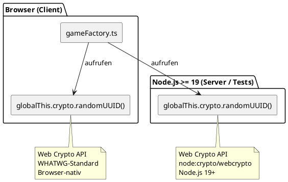

# Architektur: UUID-Generierung — Browser-Kompatibilität

**Feature:** `uuid-browser-compatibility`  
**Datum:** 2026-06-09  
**Autor:** Architekt-Rolle

---

## Problem

`gameFactory.ts` erzeugt UUIDs für `Player.id` und `Game.id`. Nach dem Fix
für den Vitest-Test-Runner (PR #5) wurde `import { randomUUID } from "node:crypto"`
eingeführt. Das ist ein **Node.js-spezifisches Modul** — Next.js bündelt
`gameFactory.ts` aber auch für den **Browser** (Client-Side Rendering), wo
`node:crypto` nicht existiert:

```
Uncaught TypeError: (0 , h.randomUUID) is not a function
```

Die App bricht beim Klick auf „Spiel starten" sofort ab.

---

## Bounded Context

Betroffen: **Game-Bounded-Context**, `createPlayer` und `createGame` in
`src/domain/gameFactory.ts`. Keine externen Integrationspunkte.

---

## Lösung: Web Crypto API (isomorphic)

`globalThis.crypto.randomUUID()` ist der WHATWG-Standard und funktioniert in:

| Umgebung | Verfügbar seit |
|----------|----------------|
| Alle modernen Browser | Chrome 92, Firefox 90, Safari 15 |
| Node.js (globalThis.crypto) | Node.js 19 |
| Node.js 24 (dieses Projekt) | ✅ |
| Vitest (node-environment, Node 24) | ✅ |

Kein Import nötig — `globalThis.crypto` ist überall ein globales Objekt.

---

## Kontextdiagramm: UUID-Generierung




---

## NVM und Node-Version

Das Projekt verwendet **NVM** mit `.nvmrc: 24`. Vercel liest `engines.node`
aus `package.json` (`>=24.0.0`) und verwendet Node 24 für Builds.

Es gibt noch **keine GitHub Actions CI-Pipeline**. Wenn eine ergänzt wird,
muss sie `.nvmrc` respektieren (via `actions/setup-node` mit
`node-version-file: .nvmrc`).

---

## Entscheidung

Siehe [ADR-004](../decisions/ADR-004-globalthis-crypto-uuid.md)
